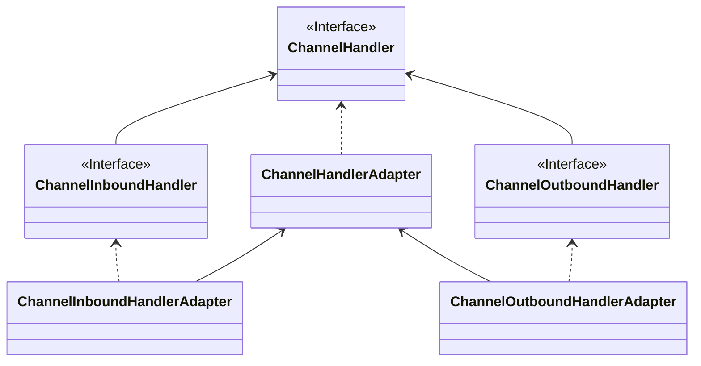

### Netty 核心 API 介绍

#### ChannelHandler 及其实现类

API 关系如下：

> 如果图片无法显示，请看这里
>
> ​​

Netty 开发中需要定义一个 Handler 类去实现 ChannelHandler 接口或其子类或其实现类，然后通过重写相关方法实现业务逻辑：

* public void channelActive(ChannelHandlerContext ctx)：通道就绪事件
* public void read(ChannelHandlerContext ctx, Object msg)：通道读取数据事件
* public void readComplete(ChannelHandlerContext ctx)：数据读取完毕事件
* publi void exceptionCaught(ChannelHandlerContext ctx, Throwable cause)：通道发生异常事件

#### ChannelPipline

ChannelPipline 是一个 handler 集合，它负责处理和拦截 inbound 和 outbound 事件和操作，相当于一个贯穿 Netty 的责任链。

​​

如果客户端和服务端的 handler 是一样的，那么消息从客户端到服务端或者反过来，每个 inbound 类型或许 outbound 类型只会经过一次，混合类型（同时实现了 inbound 和 outbound 的 handler）的 handler 会经过两次。

ChannelPipline 中的每个 ChannelHandlerContext 中都含有一个 ChannelHandler。

**InboundHandler 是按照 Pipline 的加载顺序顺序执行，OutboundHandler 是按照 Pipline 的加载顺序逆序执行。**

#### ChannelHandlerContext

事件处理器上下文对象，Pipline 链中的实际处理节点。

每个处理节点 ChannelhandlerContxet 包含一个具体的处理器 ChannelHandler，同时 ChannelHandlerContext 中也绑定了对应的 ChannelPipline 和 Channel 的信息，方便对 ChannelHandler 进行调用。常用方法如下：

* ChannelFuture close()：关闭通道
* ChannelOutboundInvoker flush()：刷新
* ChannelFuture writeAndFlush(Object msg)：将数据写入 ChannelPipline 中当前 ChannelHandler 的下一个 ChannelHandler 开始处理（出站）

#### ChannelOption

Netty 在创建 Channel 实例后，一般都需要设置 ChannelOption 参数。

ChannelOption 是 socket 的标准参数，不是 Netty 特有的。常见的参数如下：

* ChannelOption.SO_BACKLOG：对应 TCP/IP 协议 listen 函数中的 backlog 参数，用来初始化服务器可连接队列大小。

  服务端处理客户端连接请求是顺序处理的，所以同一时间只能处理一个客户端连接。

  多个客户端来的时候，服务端将不能处理的客户端请求放在等待队列里，backlog 参数指定了队列的大小。
* ChannelOption.SO_KEEPALIVE：一直保存连接处于活动状态。该参数用于设置 TCP 连接。

  当设置该选项之后，会测试连接的状态，用于可能长时间没有数据交流的连接。

  当设置该选项后，如果两小时内没有数据通信时，TCP 会自动发送一个活动探测数据报文。

#### ChannelFuture

表示 Channel 中异步 I/O 操作的结果。

在 Netty 中所有的 I/O 操作都是异步的，IO 的调用会直接返回，调用者并不能立即获得结果，但是可以通过 ChannelFuture 来获取 I/O 操作的处理状态。

常用方法如下：

* Channel channel()：返回当前正在进行 IO 操作的通道
* ChannelFuture sync()：等待异步操作执行完毕，将异步改为同步

#### EventLoopGroup 和实现类 NioEventLoopGroup

EventLoopGroup 是一组 EventLoop 的抽象，Netty 为了更好的利用多核 CPU 的资源，一般会有多个 EventLoop 同时同工作，每个 EventLoop 维护着一个 Selector 对象。

EventLoopGroup 提供 next 接口，可以从组里面按照一定规则，获取其中一个 EventLoop 来处理任务。

在 Netty 的服务端编程中，一般需要提供两个 EventLoopGroup，例如：BossEventLoopGroup 和 WorkerEventLoopGroup。

通常一个服务端口就是一个 ServerSocketChannel，对应一个 Selector 和一个 EventLoop 线程。

BossEventLoop 负责接收客户端连接，并将 SocketChannel 交给 WorkerEventLoopGroup 进行 I/O 处理。

​​

BossEventLoopGroup 通常是一个单线程的 EventLoop，EventLoop 维护者一个注册了 ServerSocketChannel 的 Selector 实例。

BossEventLoop 不断轮询 Selector，将连接事件分离出来，通常是 ON_ACCEPT 事件，然后将接收到的 SocketChannel 交给 WorkerEventLoopGroup。

WorkerEventLoopGroup 会由 next 选择其中一个 EventLoopGroup 来讲这个 SocketChannel 注册到其维护的 Selector，并对其后的 IO 事件进行处理。

一般情况下都是使用 NioEventLoopGroup，常用方法如下：

* public NioEventLoopGroup()：构造方法，创建线程组
* public Future<?> shutdownGracefully()：断开连接，关闭线程

#### ServerBootStrap 和 Bootstrap

ServerBootstrap 是 Netty 中的服务端启动助手，通过它可以完成服务端的各种配置。

Bootstrap 是 Netty 中的客户端启动助手，通过它可以完成客户端的各种配置。常见方法如下：

* public ServerBootstrap group(EventLoopGroup parentGroup, EventLoopGroup childGroup)：用于服务端，用于设置两个 EventLoop
* public B group(EventLoopGroup group)：用于客户端，用于设置一个 EventLoop
* public B channel(Class<? Extends C> channelClass)：该方法用于设置服务端的通道实现
* public B option(ChannelOption option, T value)：用来给 ServerChannel 添加配置
* public ServerBootstrap childOption(ChannelOption option, T value)：用来给接收到的通道添加配置
* public ServerBootstrap childHandler(ChannelHandler childHandler)：该方法设置业务处理类，自定义 Handler
* public ChannelFuture bind(int inetPort)：该方法用于服务端，用来设置占用的端口号
* public ChannelFuture connect(String inetPort, int inetPort)：该方法用于客户端，用于连接服务端

#### Unpooled 类

这是 Netty 提供的一个专门用来操作缓冲区的工具类，常用方法如下：

* public static ByteBuf copiedBuffer(CharSequence string, Charset charset)：通过给定的数据和字符编码返回一个 BuyeBuf 对象，类似于 NIO 中的 ByteBuffer 对象。